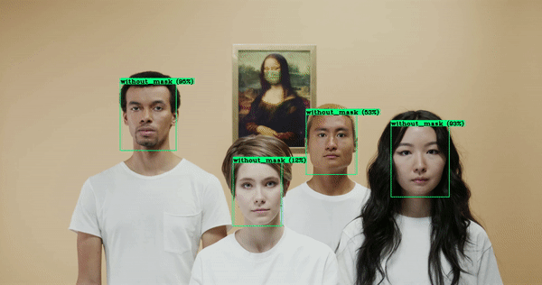

# Training a custom Yolov4 detector for mask detection

Colab tutorial for training a custom Yolov4 detector. 

https://colab.research.google.com/drive/1zqRb08ljHvIIMR4fgAXeNy1kUtjDU85B?usp=sharing

# Object Detection for masks

Check out my Medium article for this.

https://medium.com/@techzizou007/training-a-custom-detector-using-yolov4-darknet-61a659d4868

Also , check out my YouTube video on this 

[Youtube Link](https://www.youtube.com)

# **CREDITS**

   **REFERENCES**
 
*    [Alexey AB GitHub ](https://github.com/AlexeyAB/darknet)

*    [pjreddie Github ](https://github.com/pjreddie/darknet)

*    [theAIGuysCode GitHub](https://github.com/theAIGuysCode/YOLOv4-Cloud-Tutorial)

   **DATASET SOURCES**

You can download labeled datasets from the sites mentioned below. These sites contain images of many classes along with their annotations/labels in multiple formats such as the YOLO_DARKNET txt files and the PASCAL_VOC xml files.

*   [Open Images Dataset by Google](https://storage.googleapis.com/openimages/web/index.html)

*   [Kaggle Datasets](https://www.kaggle.com/datasets)

*   [Roboflow Public Datasets](https://public.roboflow.com/)

*   [VisualData Datasets](https://www.visualdata.io/discovery)

   **MASK DATASET SOURCES**

*   [Prajnasb Github](https://github.com/prajnasb/observations)

*   [Andrewmvd Kaggle](https://www.kaggle.com/andrewmvd/face-mask-detection)

*   [X-zhangyang Github](https://github.com/X-zhangyang/Real-World-Masked-Face-Dataset)

*   [Chandrikadeb7 Github](https://github.com/chandrikadeb7/Face-Mask-Detection)

