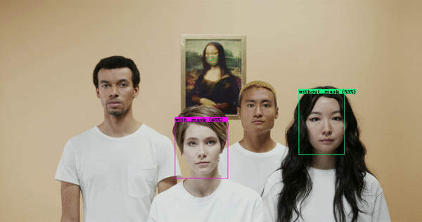

# Yolov4

Colab tutorial for training your custom Yolov4 detector. 

https://colab.research.google.com/drive/1zqRb08ljHvIIMR4fgAXeNy1kUtjDU85B?usp=sharing

# Object Detection for people with masks and without masks

Check out my Medium article for this.

https://medium.com/@techzizou007/training-a-custom-detector-using-yolov4-darknet-61a659d4868
