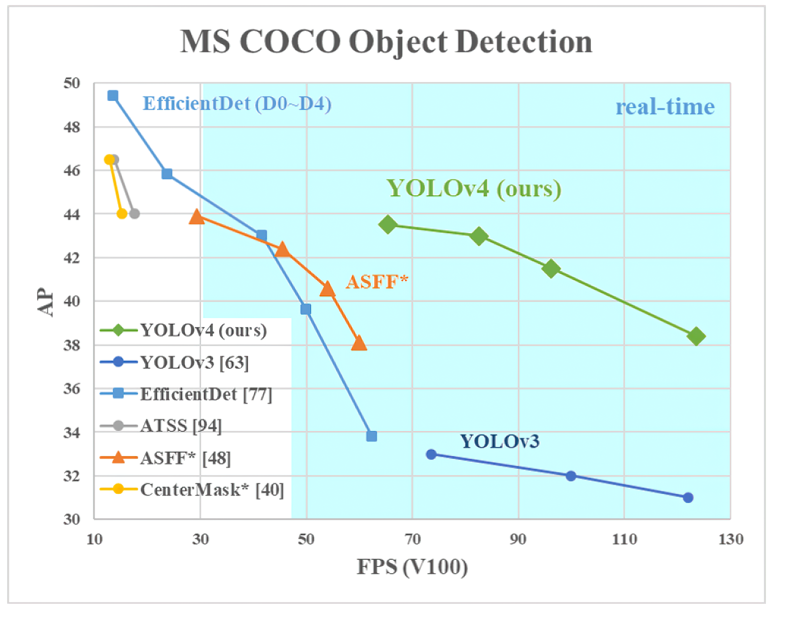

# Training a custom detector for mask detection using YOLOv4

## Colab tutorial for training a custom Yolov4 detector. 

https://colab.research.google.com/drive/1zqRb08ljHvIIMR4fgAXeNy1kUtjDU85B?usp=sharing

## Check out my Medium article on this.

https://medium.com/@techzizou007/training-a-custom-detector-using-yolov4-darknet-61a659d4868

## Check out my YouTube video on this 

[Youtube Link](https://www.youtube.com)

## What is YOLOv4?
YOLO stands for You Only Look Once. YOLO is a state-of-the-art, real-time object detection system. It was developed by Joseph Redmon.
YOLO uses a totally different approach than other previous detection systems. It applies a single neural network to the full image. This network divides the image into regions and predicts bounding boxes and probabilities for each region. These bounding boxes are weighted by the predicted probabilities.

YOLOv4 is an object detection algorithm that is an evolution of the YOLOv3 model. The YOLOv4 method was created by Alexey Bochkovskiy, Chien-Yao Wang, and Hong-Yuan Mark Liao. It is twice as fast as EfficientDet with comparable performance. In addition, AP (Average Precision) and FPS (Frames Per Second) in YOLOv4 have increased by 10% and 12% respectively compared to YOLOv3.

YOLOv4 uses many new features and combines some of them to achieve state-of-the-art results: 43.5% AP (65.7% AP50) for the MS COCO dataset at a real-time speed of ~65 FPS on Tesla V100.

## **CREDITS**

   **References**
 
*    [Alexey AB GitHub ](https://github.com/AlexeyAB/darknet)

